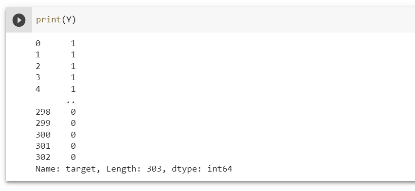

# 4. Understanding Code

## 4.1. Importing the Dependencies :-

### 1. Importing following modules: numpy, pandas, and some Sk-learn modules.

## 4.2. Data Collection and Processing :-

### 2. This is how to upload your data using Pandas module.

### 3. This will show you first 5 rows data from your data set.

### 4. This will show you last 5 rows data from your data set

### 5. How to know total number of rows and columns in your dataset.

### 6. Getting some general information about the data. (303 non-null means we don’t have any missing values and Dtype tells their data type.)

### 7. Another method for Checking for missing values in our data set. 

### 8. Statistical measures about the data. 

### 9. Checking the distribution of Target Variable. 1-> Represents the Defective Heart and 0-> represents Healthy Heart.

## 4.3. Splitting the features and targets :-

### 10. Splitting the features and targets.

### 11. Printing X

### 12. Printing Y

### 13. Splitting the data into training data and test data.

### 14. Logistic Regression

## 4.4. Model Evaluation

### Accuracy Score:

### 15. Accuracy on Training data set.

### 16. Accuracy on Test data set. 

### b. Building a Predictive System:

### 17. Building a predictive system.

