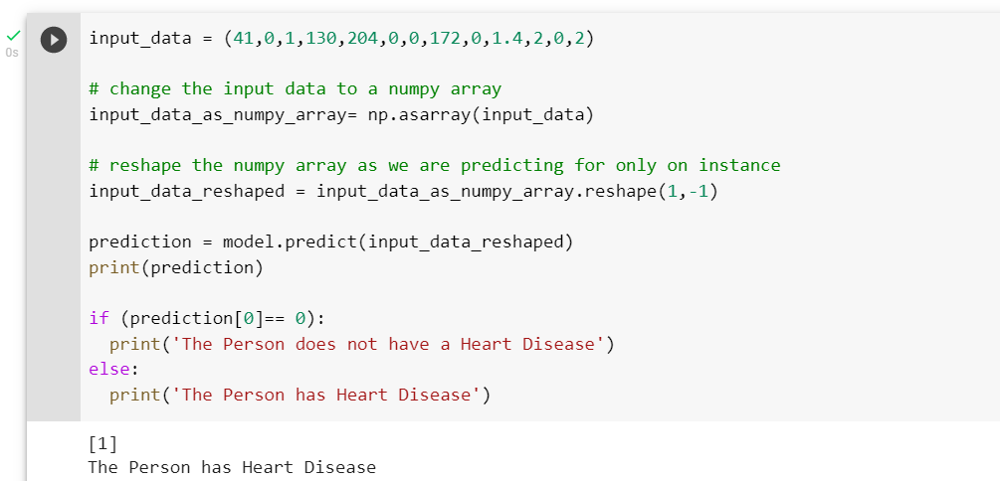
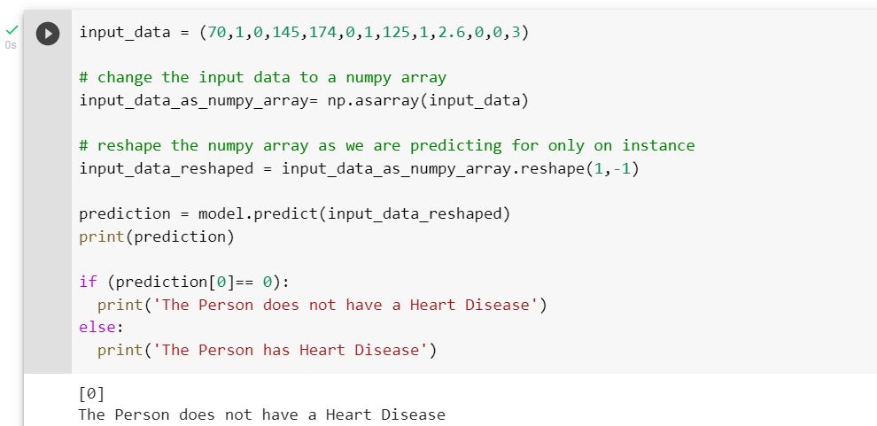

# Testing / Result and Analysis

## Test Output 1 (Defective hearts):

## Test Output 2 (Healthy hearts):

Hence, according to the results, if we give all data except 14th column (Target) as an input then it will give us the data in 0 or 1 which describes that person has ‘Heart Disease’ or not.

